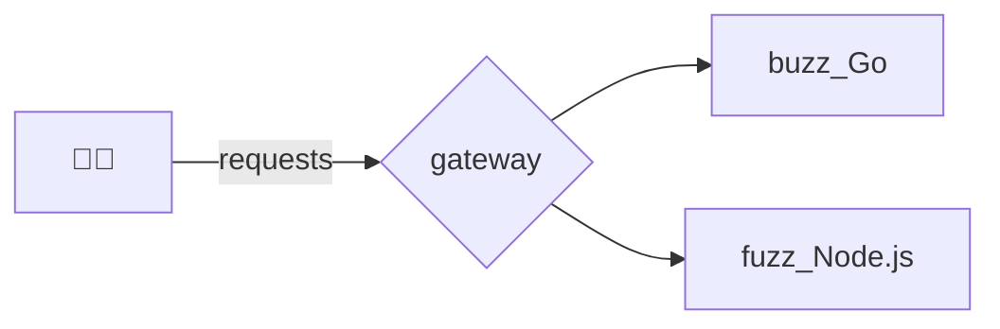

## GoGrpc-Mis

```mermaid
<!-- RRH -->
flowchart LR
    A[👨‍💼] -->|requests| B{gateway_chan}
    B --> C[buzz_R1_Go]
    B --> D[buzz_R2_Go]
    B --> J[buzz_R3_Go]
```



Benchmark

👉 Fuzz


👉 Buzz


👉 Buzz_RRH


