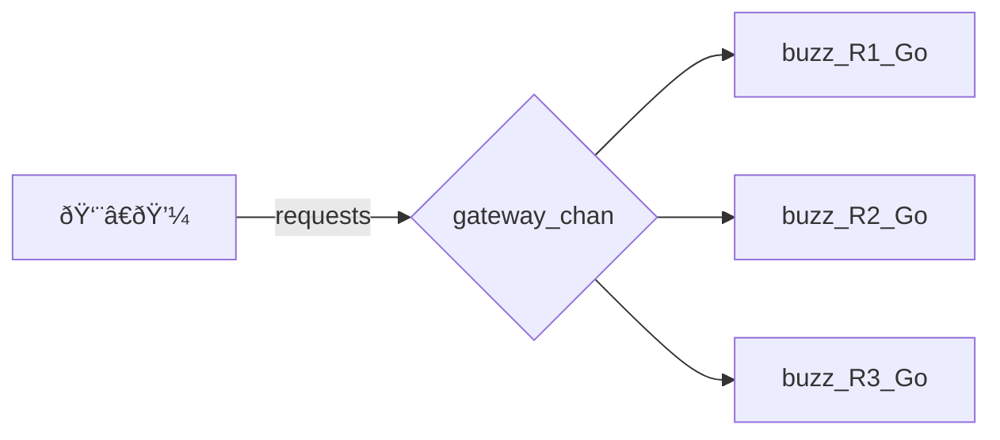
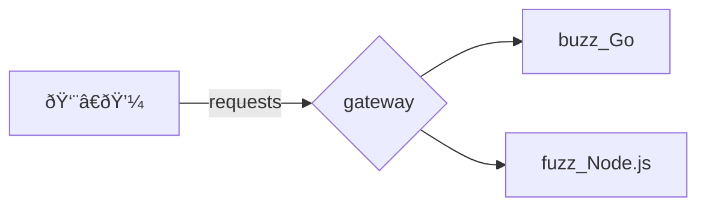

## GoGrpc-Mis

```mermaid
flowchart LR
    A[👨â€ðŸ’¼] -->|requests| B{gateway_chan}
    B --> C[buzz_R1_Go]
    B --> D[buzz_R2_Go]
    B --> J[buzz_R3_Go]
```

```mermaid
flowchart LR
    A[👨â€ðŸ’¼] -->|requests| B{gateway}
    B --> C[buzz_Go]
    B --> D[fuzz_Node.js]
```

Benchmark

👉 Fuzz

👉 Buzz

